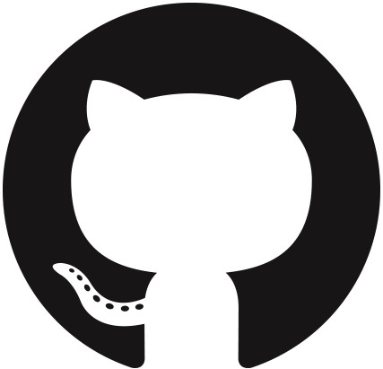

<!-- # Dongyang Li  -->
<h1 align="center">
  Hi, I'm <a href="https://dongyangli-del.github.io/" target="_blank">Dongyang Li (李东洋) 👋</a>  
	
	
 
&nbsp;
&nbsp;
&nbsp;
&nbsp;
&nbsp;

</h1>

Hi there! I am Dongyang Li (李东洋), a last-year M.S. student in <a href="https://faculty.sustech.edu.cn/?tagid=liuqy&iscss=1&snapid=1&orderby=date&go=1">NCClab@SUSTech</a>, majoring in Electronic Engineering at <a href="https://www.sustech.edu.cn/en/">Southern University of Science and Technology</a>, Shenzhen, China.
My supervisor is <a href="https://www.sustech.edu.cn/zh/faculties/liuquanying.html">Prof. Quanying Liu</a>. I have previously worked with <a href="https://mi.eng.cam.ac.uk/~cz277/">Prof. Chao Zhang</a>. During my PhD, I will be jointly supervised by <a href="https://life.tsinghua.edu.cn/lifeen/info/1035/1581.htm">Prof. Xiaoxuan Jia</a> and <a href="https://lywang3081.github.io/">Prof. Liyuan Wang</a>, and I plan to pursue research on Brain-Inspired AI algorithms and Brain-Computer Interfaces.

My main research interests lie in leveraging **Multimodal Large Language Models (MLLMs)** and **Generative Models** to construct **Bidirectional Brain-Computer Interfaces (BCIs)**, thereby advancing **Physical AI** and **NeuroAI**. My mission is to architect the next generation of General Artificial Intelligence by integrating brain-inspired intelligence principles with MLLMs—unraveling neural mechanisms underlying human perception and motor behavior, and translating these findings into robust physical and linguistic intelligence.

## 🏠 About Me

- 🔭 I’m currently studying at [Southern University of Science and Technology](https://www.sustech.edu.cn/en/) (M.Sc., expected Jun 2026)
- 🌱 I’m currently learning **MLLMs, generative models, and bidirectional BCIs**
- 👯 I’m looking to collaborate on **NeuroAI, Physical AI, and multimodal brain decoding**
- 📫 Contact: **lidy2023@mail.sustech.edu.cn** (or click the icons above)

## 📝 First / Co-first Author

* **[ICLR 2026]** MindPilot: Closed-loop Visual Stimulation Optimization for Brain Modulation with EEG-guided Diffusion, [Paper](https://arxiv.org/abs/2602.10552) · [Repo](https://github.com/ncclab-sustech/MindPilot) 
* **[ACM MM 2025]** BrainFLORA: Uncovering Brain Concept Representation via Multimodal Neural Embeddings (Oral), [Paper](https://arxiv.org/abs/2507.09747) · [Repo](https://github.com/ncclab-sustech/BrainFLORA) 
* **[NeurIPS 2024]** Visual Decoding and Reconstruction via EEG Embeddings with Guided Diffusion (Poster), [Paper](https://arxiv.org/abs/2403.07721) · [Repo](https://github.com/dongyangli-del/EEG_Image_decode) 

## 🏆 Awards

- **1st place**, Speech Detection (Standard Track), NeurIPS 2025 LibriBrain Competition, 2025.12
- Provincial Special Award and National Bronze Award, "Challenge Cup" National University Student Innovation and Entrepreneurship Plan Competition, 2020.10
- National First Prize (Captain), China Robot Competition and RobotCup Advanced Vision Competition 3D Recognition Project, 2022.04
- National First Prize (Captain), China Robot Competition and RobotCup Advanced Vision Competition Industrial Measurement Project, 2022.04
- National Second Prize (Captain), "MathorCup" University Mathematical Modeling Challenge, 2021.07
- Provincial First Prize (Captain), National College Student Mathematical Modeling Competition, 2021.11
